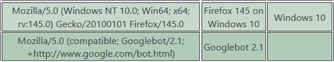
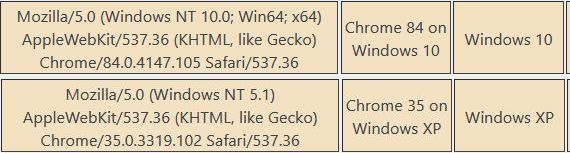
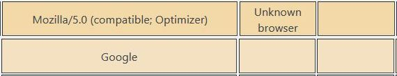

# Block old browser versions and suspicious browsers

Contributors: hupe13   
Tags: bad bots, ban, blocking, security, monitor   
Tested up to: 6.8   
Stable tag: 251101   
Requires at least: 6.5   
Requires PHP: 8.3   
License: GPLv2 or later   

With help of WhatIsMyBrowser the plugin detects old and suspicious agents and denies them access. A special robots.txt prevents crawling by bad bots.

## Description

The plugin uses WhatIsMyBrowser.com to get informations about the browser. It detects old and suspicious browsers and denies them access to your website. It provides a robots.txt file to prohibit crawling and blocks crawlers if they do so anyway.

<ul>
<li>Get an API key from <a href="https://developers.whatismybrowser.com/api/">What is my browser?</a> for a Basic Application Plan.</li>
<li>You have a limit of 5000 hits / month for Parsing User Agent. Thats why the plugin manages a database table.</li>
<li>The user agent string of every browser accessing your website the first time is send to this service and some data will be stored in this table:

Browsers will be blocked, if the browser and/or the system is an old one: Default: Chrome and Chrome based browsers &lt; 128, Firefox &lt; 128, Internet Explorer, Netscape (!), Opera &lt; 83, Safari &lt; 17 
Old systems are all Windows versions before Windows 10, some MacOS and Android versions. 

It will be blocked also if the "simple software string" contains "unknown" or is empty.

</li><li>You can configure other browsers too.</li>
<li>Sometimes there are false positive, for example if the browser is from Mastodon. Then you can exclude these from checking.</li>
<li>The plugin checks, if the crawlers are really from Google, Bing, Yandex, Apple, Mojeek, Baidu, Seznam.</li>
</ul>

### About robots.txt

* You can configure some rewrite rules, to provide a robots.txt to enable or to disable crawling for a browser. If crawling is disabled, access to your website will be blocked for that browser.

### Logging

* The logging is very verbose. Please check the logs and the WIMB table regularly.
* To do: log level

## Updates

Please install [leafext-update-github](https://github.com/hupe13/leafext-update-github) to get updates and keep an eye on this repository in case I've made any mistakes.
